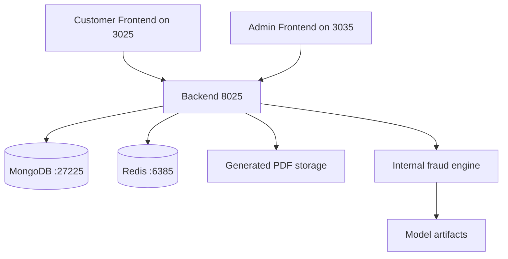
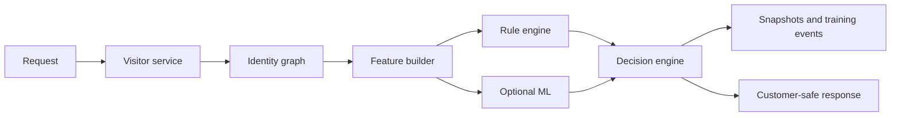
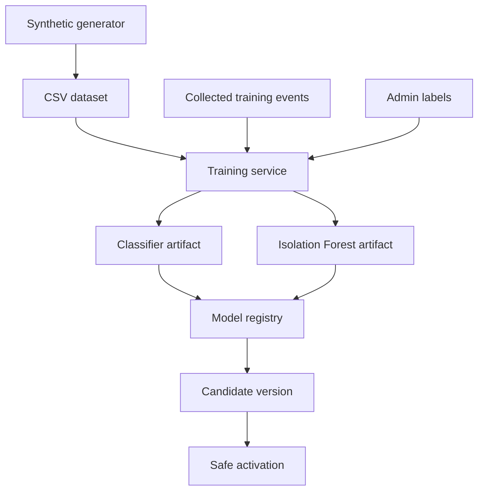

# Architecture

## Full System Architecture

The backend is the single source of truth. The customer-facing PDFCraft app in
`frontend/` and the internal admin dashboard in `pdfcraft-guardian-main/` are
separate frontends that both call the same FastAPI backend on port `8025`.

## Backend Module Structure

- `app/routes`: HTTP API routes
- `app/services`: business workflows
- `app/repositories`: Mongo access
- `app/fraud_engine`: identity graph, feature builder, rule engine, ML model, training services
- `app/schemas`: request/response models
- `scripts`: demo, training, synthetic data, final checks

## Frontend Module Structure

- `frontend/`: customer-facing PDFCraft app on port `3025`
- `pdfcraft-guardian-main/`: internal admin dashboard on port `3035`
- Both frontends use `VITE_API_BASE_URL` to call the backend on port `8025`
- Customer UI must not link to admin routes or expose internal fraud/ML details

## Data Collections

- `visitors`
- `generated_pdfs`
- `users`
- `refresh_tokens`
- `user_usage`
- `fraud_events`
- `visitor_identity_links`
- `fraud_feature_snapshots`
- `risk_score_snapshots`
- `fraud_decisions`
- `fraud_training_events`
- `fraud_labels`
- `ml_model_versions`
- `admin_audit_logs`

## API Groups

- `/api/public`: public customer config
- `/api/visitor`: anonymous visitor identify/status
- `/api/pdf`: generation, history, download
- `/api/auth`: signup, login, refresh, logout, me
- `/api/account`: account usage
- `/api/admin`: protected admin dashboard, events, visitors, PDFs, audit, ML

## Fraud Engine Architecture

## ML Pipeline Architecture

## Deployment Architecture

Docker Compose starts five services on fixed project ports:

- Backend: `8025`
- Customer frontend: `3025`
- Admin frontend: `3035`
- MongoDB host: `27225`
- Redis host: `6385`

The project intentionally avoids common ports like `3000`, `8000`, `8010`, `5432`, `6379`, and `27017`.
