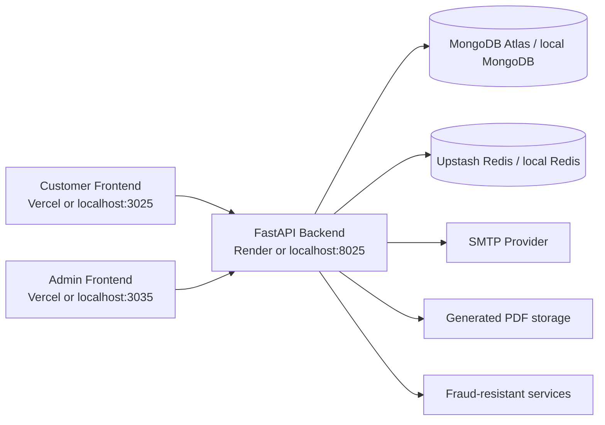
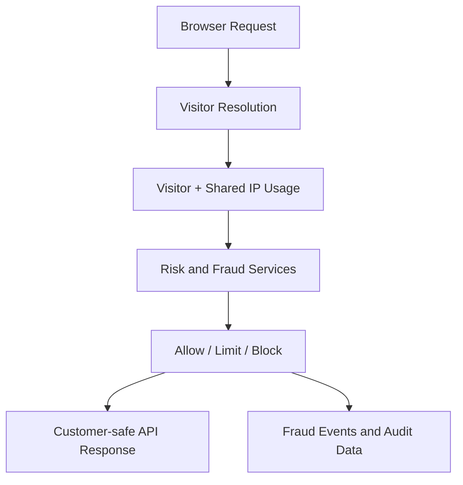
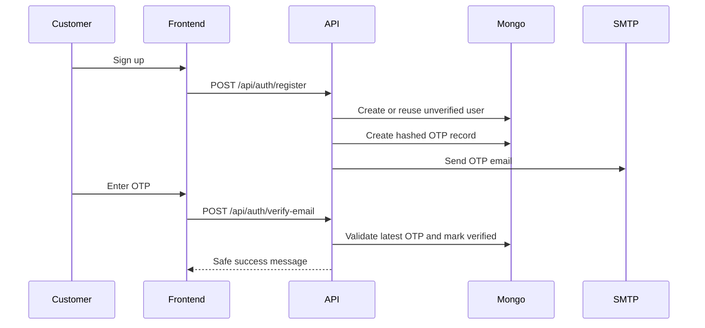

# Architecture

## System Overview

PDFCraft has three application surfaces:

- `frontend/`: customer-facing React/Vite application
- `backend/`: FastAPI API and business logic
- `pdfcraft-guardian-main/`: internal admin dashboard

The backend is the system of record. Both frontends communicate with the same API, but the customer UI is intentionally isolated from admin-only operational and fraud-analysis details.

## Backend Structure

- `app/routes`: HTTP routes and endpoint definitions
- `app/services`: application workflows and business rules
- `app/repositories`: MongoDB data access
- `app/schemas`: request and response models
- `app/core`: auth, middleware, and shared request utilities
- `app/fraud_engine`: rule engine, identity graph, features, training, and model registry
- `scripts`: operational helpers, demos, and ML training utilities

## Data Model

Core MongoDB collections:

- `users`
- `email_verifications`
- `refresh_tokens`
- `visitors`
- `anonymous_ip_usage`
- `generated_pdfs`
- `user_usage`
- `fraud_events`
- `visitor_identity_links`
- `fraud_feature_snapshots`
- `risk_score_snapshots`
- `fraud_decisions`
- `fraud_training_events`
- `fraud_labels`
- `ml_model_versions`
- `admin_audit_logs`

## Request Flow

Typical customer flow:

1. Customer app loads public config from `/api/public/config`.
2. Customer app identifies the anonymous visitor through `/api/visitor/identify`.
3. Customer requests visitor status through `/api/visitor/status`.
4. Customer generates a PDF through `/api/pdf/generate`.
5. Backend enforces anonymous or authenticated limits, produces a PDF, stores metadata, and returns a customer-safe response.

Authenticated account flow:

1. Customer signs up through `/api/auth/register`.
2. Backend creates an unverified user and email verification record.
3. Customer verifies the OTP through `/api/auth/verify-email`.
4. Customer logs in through `/api/auth/login`.
5. Customer accesses protected routes such as `/api/account/usage` and `/api/pdf/my-history`.

## Fraud-Resistant Tracking Flow

PDFCraft does not rely on a single client-side identifier. Anonymous usage and abuse resistance are evaluated through multiple signals:

- cookie-based visitor continuity
- local storage identifiers
- session identifiers
- device profile hashes
- fingerprint-derived signals
- IP address history
- shared anonymous IP quota
- VPN or proxy indicators
- proxy-chain awareness when available

High-level flow:

1. Visitor identifiers are collected in the customer frontend.
2. Backend resolves or creates the visitor record.
3. Shared anonymous IP usage is consulted alongside visitor-level usage.
4. Fraud and risk services compute a score and capture events when needed.
5. Customer endpoints still return clean product messages without exposing internal enforcement logic.

## Email Verification Flow

Email verification is part of the customer auth lifecycle and is intentionally separated from login success.

1. Register request normalizes and validates email input.
2. Backend creates an unverified user or resends a code for an existing unverified account.
3. Email verification service generates a six-digit OTP and stores only its hash.
4. The configured SMTP provider sends the OTP email.
5. Verification checks the latest unconsumed record, expiry, and max attempts.
6. On success, the user is marked `email_verified=true` and can then log in.

## Admin Flow

The admin dashboard is separate from the customer application and requires either:

- `X-Admin-API-Key`
- admin JWT authentication

Admin capabilities include:

- fraud summary and event review
- visitor investigations
- PDF activity review
- audit logs
- ML training and model activation flows
- SMTP readiness checks through `/api/admin/email/status`

Customer endpoints do not expose these internals.

## Deployment Flow

Production deployment is split by responsibility:

- Render hosts the FastAPI backend
- Vercel hosts the customer frontend
- Vercel hosts the admin frontend
- MongoDB Atlas provides persistent data storage
- Upstash Redis provides rate limiting state
- A dedicated SMTP provider provides OTP delivery

Detailed environment and rollout steps are documented in [DEPLOYMENT.md](DEPLOYMENT.md).
