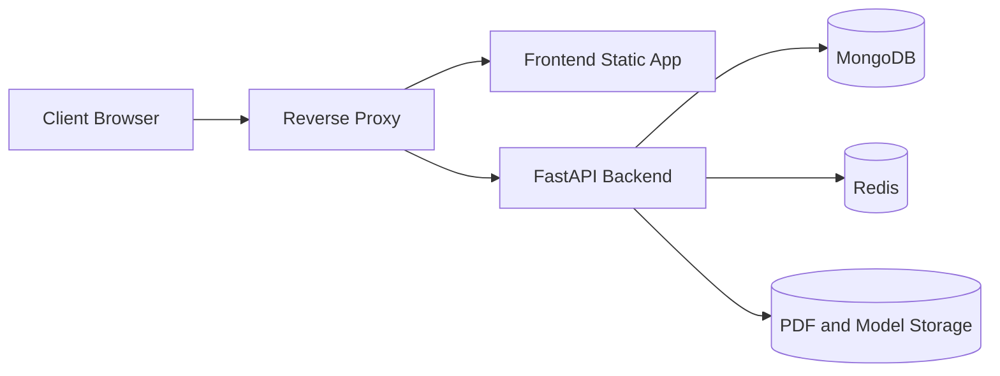

# PDFCraft Production Deployment

## 1. Deployment Overview

The production stack runs PDFCraft behind an Nginx reverse proxy:



Current deployable version:

- One reverse proxy container
- One frontend container serving the Vite build through Nginx
- One FastAPI backend container
- One MongoDB container
- One Redis container
- Docker volumes for MongoDB, Redis, PDFs, ML model files, and proxy certificates

Do not expose MongoDB or Redis public ports in production.

## 2. Local vs Production Architecture

Local development uses `docker-compose.yml` and keeps these host ports:

- Frontend: `3025`
- Backend: `8025`
- MongoDB: `27225`
- Redis: `6385`

Production uses `docker-compose.prod.yml`. Only the reverse proxy exposes host ports `80` and `443`. Backend, frontend, MongoDB, and Redis stay on the internal Docker network.

## 3. Required Production Environment Variables

Copy and edit:

```bash
cp backend/.env.production.example backend/.env.production
cp frontend/.env.production.example frontend/.env.production
```

Required backend changes:

- `JWT_SECRET_KEY`: strong random secret, at least 32 characters
- `ADMIN_API_KEY`: strong admin key, at least 24 characters
- `FRONTEND_URL`: HTTPS frontend domain
- `BACKEND_PUBLIC_URL`: HTTPS API domain
- `CORS_ORIGINS`: frontend HTTPS origin only
- `SECURE_COOKIES=true`
- `ENABLE_DEFAULT_ADMIN_SEED=false` unless a strong non-default admin password is configured
- `TRUST_PROXY_HEADERS=true` only behind the configured reverse proxy/network
- `TRUSTED_PROXY_IPS`: Docker proxy subnet or reverse proxy IP/CIDR

Required frontend change:

- `VITE_API_BASE_URL=https://api.your-domain.com`

Vite injects `VITE_*` values at build time. Set `VITE_API_BASE_URL` before building the frontend image.

## 4. Docker Production Deployment

Validate configuration:

```bash
python3 scripts/check_production_env.py --env backend/.env.production
docker compose -f docker-compose.prod.yml config
```

Start:

```bash
./deploy-prod.sh
```

This validates env files, validates Compose config, builds images, and starts the stack.

## 5. Reverse Proxy Setup

Nginx config lives in:

- `deploy/nginx/nginx.conf`
- `deploy/nginx/conf.d/pdfcraft.conf`

Default routing:

- `https://your-domain.com/` -> frontend
- `https://api.your-domain.com/` -> backend

The proxy forwards:

- `X-Forwarded-For`
- `X-Real-IP`
- `X-Forwarded-Proto`
- `Host`

FastAPI deployments behind a reverse proxy need forwarded-header handling. The backend only uses forwarded client IP headers when `TRUST_PROXY_HEADERS=true`, and production should configure `TRUSTED_PROXY_IPS` to the proxy IP or Docker subnet.

## 6. HTTPS/TLS Notes

The production compose file exposes `80` and `443` and mounts `fraud_pdf_proxy_certs` at `/etc/nginx/certs`. Add certificates and update `deploy/nginx/conf.d/pdfcraft.conf` with `listen 443 ssl` blocks, then redirect HTTP to HTTPS.

You can also terminate TLS at a cloud load balancer and keep this Nginx proxy private.

## 7. Database and Redis Notes

MongoDB indexes are created idempotently at backend startup. Existing indexes do not crash startup. For large production databases, schedule index changes carefully and test them before rollout.

Redis is used for rate limiting and should be shared by all backend replicas.

## 8. File and Model Storage Notes

The current version uses local Docker volumes:

- `fraud_pdf_pdf_storage`
- `fraud_pdf_model_storage`

This is suitable for a single backend container. For multiple backend replicas, move generated PDFs and model artifacts to shared storage such as S3, R2, MinIO, or a shared filesystem.

## 9. Backup and Restore

MongoDB backup:

```bash
scripts/backup_mongo.sh
```

MongoDB restore:

```bash
scripts/restore_mongo.sh backups/mongo/YYYYMMDD_HHMMSS/mongo.archive
```

Storage/model backup:

```bash
scripts/backup_storage.sh
```

Restore scripts never run automatically. Mongo restore asks for confirmation.

## 10. Logs and Troubleshooting

Production logs:

```bash
docker compose -f docker-compose.prod.yml logs -f backend
docker compose -f docker-compose.prod.yml logs -f frontend
docker compose -f docker-compose.prod.yml logs -f reverse-proxy
scripts/logs.sh
```

Health endpoints:

- `GET /health`: basic service health
- `GET /live`: liveness
- `GET /ready`: MongoDB, Redis, PDF storage, and model directory readiness

Backend logs can be JSON with `JSON_LOGS=true`. Logs include request ID, method, path, status, duration, and client IP. Secrets, passwords, and tokens are not logged.

## 11. Security Checklist

- Replace all placeholder secrets before deployment.
- Keep `SECURE_COOKIES=true` in production.
- Use HTTPS frontend and backend URLs.
- Set `CORS_ORIGINS` to the real frontend domain; do not use wildcard origins with credentials.
- Set `ENABLE_API_DOCS=false` or protect docs in production.
- Keep MongoDB and Redis private.
- Use admin account login and a strong admin API key.
- Do not expose admin keys in frontend code; the current frontend stores admin key input only in `sessionStorage`.
- Refresh tokens are currently returned to the frontend and stored client-side. This is acceptable for the demo but should move to secure, HttpOnly refresh cookies for stricter production security.

## 12. Scaling Checklist

The backend is stateless except for MongoDB, Redis, PDF storage, and model files. Multiple backend replicas are viable when:

- PDF storage is shared or moved to object storage.
- Model files are shared or loaded from object storage.
- Redis is shared.
- Tokens/sessions are not stored in local memory.
- MongoDB moves to managed MongoDB or a replica set.
- Redis moves to managed Redis.
- Logs go to a central log system.
- Metrics are added with Prometheus/Grafana or a cloud equivalent.

Do not scale MongoDB/Redis by duplicating standalone containers. Use managed services or proper clustered/replicated deployments.

## 13. Rollback Steps

1. Keep the previous image tags or commit available.
2. Stop the production stack:

```bash
docker compose -f docker-compose.prod.yml down
```

3. Restore previous env files or image tags.
4. Start the stack:

```bash
docker compose -f docker-compose.prod.yml up -d
```

5. Check:

```bash
curl https://api.your-domain.com/health
curl https://api.your-domain.com/ready
```
