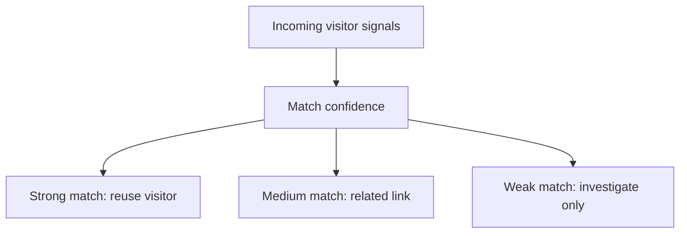

# Interview Explanation

## 1. Project Explanation In 60 Seconds

PDFCraft is a PDF generation SaaS with a protected internal fraud prevention platform. Anonymous users get two PDFs, logged-in Free users get five PDFs per month, and admins can investigate attempts to bypass the free limit. The fraud engine combines identity graph matching, rule-based scoring, synthetic-data training, optional ML models, and admin labels while keeping customer UI clean.

## 2. Problem Statement

The problem is free-limit bypass. A user may clear cookies, change sessions, switch IPs, or automate requests to keep generating free PDFs.

## 3. Why Changing IP Is Not Enough To Bypass

We do not rely only on IP. IP is weak because it changes with VPN, WiFi restart, or mobile hotspot. We link visitors using cookie, local storage ID, session ID, device fingerprint, device profile, IP/user-agent, behavior events, and identity graph confidence. Same IP alone is treated as weak signal to avoid false positives.

## 4. Multi-Signal Identity Approach

The system stores multiple visitor signals internally and compares incoming requests with existing visitors. Strong matches reuse an existing visitor, so clearing cookies or changing IP does not automatically reset usage.

## 5. Identity Graph Explanation

The identity graph stores relationships between visitors and accounts with confidence scores. Same cookie and local storage are strong signals. Same fingerprint/device profile is also strong. Same IP is weak and useful for investigation only.

## 6. Rule-Based Risk Scoring

The rule engine gives explainable points for behavior such as multiple cookies on the same fingerprint, too many sessions, webdriver automation, rapid generation, repeated blocked attempts, and risky local IP indicators.

## 7. ML Training Approach

The ML pipeline trains tabular models using PDFCraft features. It supports Random Forest or Logistic Regression plus Isolation Forest. The model outputs fraud probability and anomaly score, but the app remains safe if no model is active.

## 8. Why Synthetic Data Was Used First

At the start, real fraud labels are limited. Synthetic data gives a controlled baseline with normal, fraud, and gray-zone scenarios. Admin labels and real training events can replace weak labels over time.

## 9. Why Not Deep Learning First

This is tabular fraud data. Classical ML is faster to train, explainable, works on CPU, and is easier to review in admin workflows. A 6GB VRAM GPU can later support small neural networks or autoencoders, but that is not the right first production step.

## 10. How Customer Privacy/UX Is Protected

Customer screens never show internal fraud, ML, fingerprint, IP, or investigation terms. Customer API responses use simple messages like “Please log in to continue.”

## 11. Admin Investigation Flow

Admins log into the internal area, open visitor investigation, inspect decision history, reasons, identity links, features, labels, and model version information.

## 12. Limitations And Honest Improvements

Billing is not implemented. External IP intelligence is local-demo only. ML retraining is manual. Next steps are billing, scheduled retraining, model evaluation reports, and production observability.

## 13. Frequently Asked Interview Questions

**How do you prevent cookie clearing bypass?**  
We reuse the visitor when stronger signals like local storage, fingerprint, or device profile match.

**Can same IP block innocent users?**  
No. Same IP alone is weak and does not merge visitors.

**What happens if the ML model is missing?**  
The app still works with the rule engine fallback.

**Why admin labels?**  
Admin labels provide stronger ground truth for future retraining.

**How do logged-in users interact with anonymous state?**  
Authorization wins. Authenticated generation uses monthly account limits and is not blocked by anonymous visitor state.

