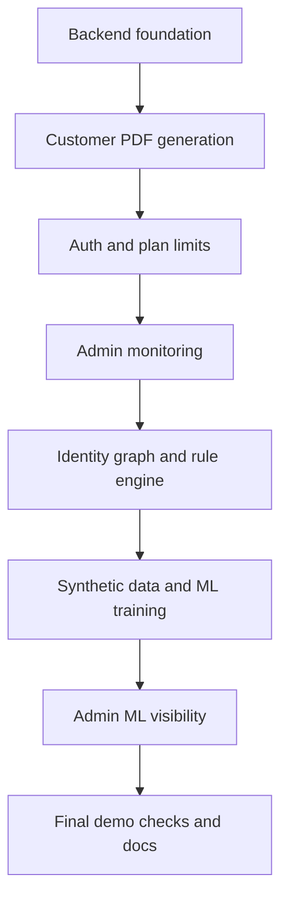
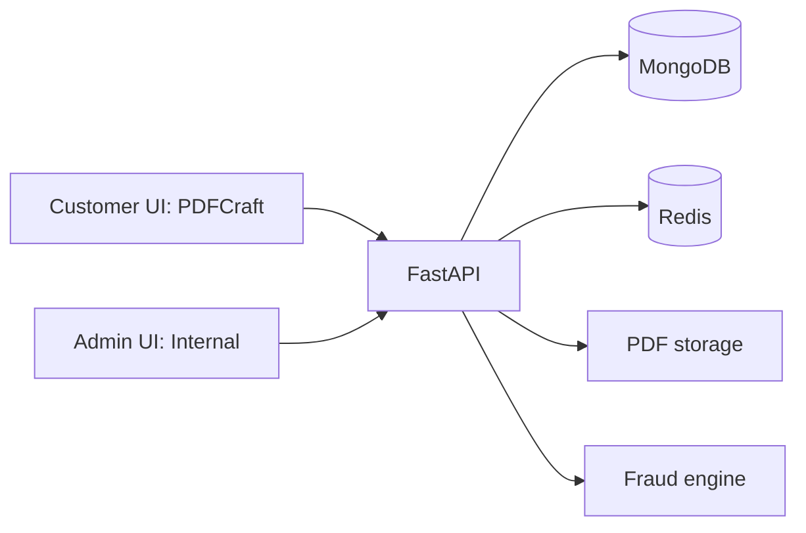
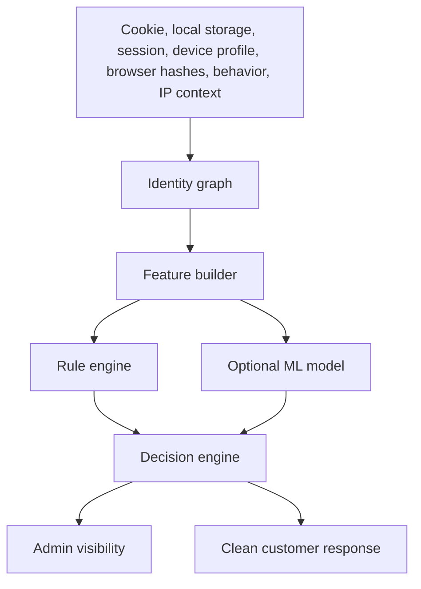
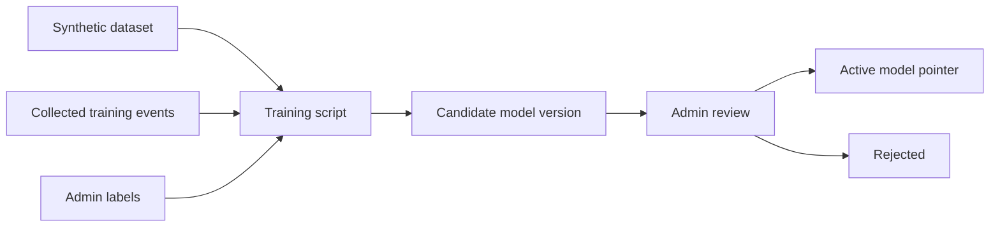
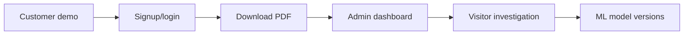

# PDFCraft SaaS + Internal Fraud Prevention System — Lead Report

## 1. Executive Summary

PDFCraft is a complete PDF generation SaaS with customer authentication, anonymous and monthly plan limits, secure PDF downloads, admin monitoring, and an internal ML-ready fraud prevention system. The customer product stays clean and simple, while the protected admin system exposes the operational data needed to investigate free-limit bypass attempts.

## 2. What Has Been Completed

- Backend FastAPI service on port `8025`
- React/Vite/Tailwind frontend on port `3025`
- MongoDB on host port `27225`
- Redis on host port `6385`
- Docker start/stop scripts
- Visitor tracking and anonymous two-PDF limit
- Signup, login, refresh tokens, logout, and account usage
- Logged-in FREE monthly limit of five PDFs
- Secure PDF history and download
- Admin dashboard and protected admin routes
- Identity graph, rule engine, synthetic dataset, ML training, model versioning, admin labels, and admin ML dashboard
- Backend tests and frontend build verified

## 3. Customer-Facing Product: PDFCraft

PDFCraft lets a visitor generate two free PDFs, then asks them to log in. A logged-in Free user gets five PDFs per month. Customers can view usage, history, account details, pricing, and download generated PDFs. Fraud and ML internals are not exposed in customer UI or customer API responses.

## 4. Internal Admin System

Fraud Proof PDF Platform is the protected internal admin system. It supports admin JWT login and local API key fallback. Admins can inspect dashboard cards, events, visitors, PDFs, audit logs, ML engine status, model versions, feature snapshots, identity links, and visitor labels.

## 5. Fraud Detection Problem Statement

The main product risk is free-limit bypass: clearing cookies, changing sessions, using new IPs, or automating PDF generation to avoid the anonymous two-PDF limit.

## 6. Why IP-only Tracking Is Weak

IP alone is weak because it changes with VPNs, WiFi restarts, mobile hotspots, workplace networks, travel, and carrier NAT. It is also shared by innocent users. The system treats same IP alone as weak evidence and does not merge visitors from IP alone.

## 7. Our Multi-Layer Solution

The design combines strong identity signals, weak contextual signals, explainable rules, optional ML scoring, and admin review labels.

## 8. ML Fraud Engine Overview

The ML pipeline starts with synthetic PDFCraft-specific data because early-stage product data is limited. The current model is CPU-friendly scikit-learn, using Random Forest or Logistic Regression plus Isolation Forest. Models are versioned as candidates before activation, and the rule engine remains a safe fallback if no active model exists.

## 9. Completed Verification

- `docker compose config`
- `./start.sh`
- Health and public config checks
- Synthetic dataset generation
- Candidate model training
- Demo fraud scenarios
- Final demo check
- Backend pytest
- Frontend build with customer UI forbidden-word scan
- `./stop.sh`

## 10. Demo Flow

Show the customer flow first: generate two PDFs, hit the third-PDF login prompt, sign up, generate as a logged-in user, download, and view history/usage. Then show the admin flow: dashboard, visitor investigation, fraud decisions, identity links, ML engine, model versions, and audit logs.

## 11. Current Limitations

- Billing is intentionally not implemented.
- ML models are classical tabular models, not deep learning.
- IP intelligence uses a local demo list, not a paid external provider.
- Admin pages are optimized for demo and investigation, not full enterprise workflow management.

## 12. Next Improvements

- Add billing and plan upgrades.
- Add production-grade observability and alerts.
- Add scheduled retraining from admin-reviewed labels.
- Add model evaluation reports before activation.
- Add optional external IP intelligence provider.
- Add richer admin filters and exports.

